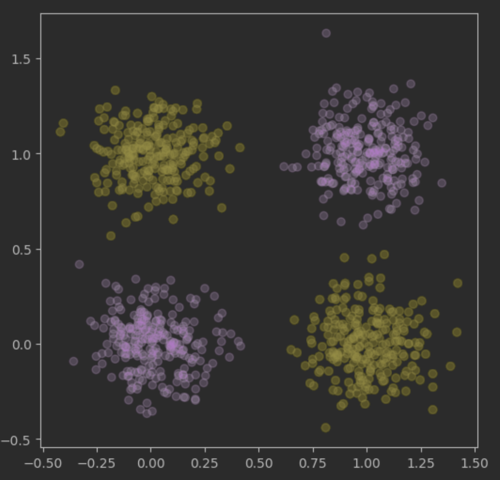

# Creare il primo modello

## training set
Durante la durata del corso verranno utilizzati dataset a forma di **matrice** (banalmente dei file csv) composti come segue:
- le *righe* rappresentano le **istanze** 
- le *colonne* sono le **features** (proprietà) del nostro dataset

Capita che, di tutto il dataset, una colonna è quella che ci interessa trovare, essa è chiamata **label**.

- nel caso in cui la label sia discreta, si parla di **classificazione**
- nel caso in cui la label sia continua, si parla di **regressione**

## training process
è il processo tramite il quale viene letto il dataset e viene creato il modello.

## modello
un modello è un oggetto che prende in input un'istanza e restituisce un'etichetta (label) che è la previsione del modello.

$$
f(x_j) = predizione
$$

Per capire se un modello è buono ne viene calcolata la **precisione** (accuracy) nel caso *discreto* e la **scarto quadratico medio** (o rooted mean square error) nel caso *continuo*.

- precisione: indica la percentuale di istanze che sono state trovate correttamente
- scarto quadratico medio: usato per calcolare la distanza tra due punti (minore la distanza maggiore la precisione)

## test set
Per poter verificare se il modello prodotto effettivamente funzione come ci si aspetta, viene utilizzato un dataset che non è stato utilizzato per la creazione del modello. Dato che non possiamo testare il modello su dati che non abbiamo (futuro), solitamete viene preso il dataset di partenza e diviso in due parti:
- 80% training set
- 20% test set

# K-Nearest Neighbors Classifiers
è un modello che si basa sul concetto di **vicinanza**. Dato un punto, il modello cerca i k punti più vicini e restituisce la label più frequente tra i k punti.

## come scegliere il k più adattto
- se $k$ è piccolo, risulterà sensibile agli errori (rumore)
- se $k$ è grande, sarà sicuramente più efficace, ma può risultare computazionalmente molto costoso

Spesso, per aumentare l'accuratezza del modello, risulta utile **normalizzare** i dati, ovvero portare i dati in un range di valori che va da 0 a 1.
La normalizzazione può essere fatta in due modi:
- **min-max normalization**: risulta più sensibile agli outliers ma è in grado di normalizzare i dati in maniera più accurata
- **normalizzazione standard**: non standardizza ogni feature, dipende dalla varianza. Una feature con una varianza molto alta avrà un peso maggiore rispetto ad una con varianza bassa.

La distanza euclidea (teorema di pitagora) assume che tutti le feature hanno la stessa importanza, cosa che non è quasi mai vera.

# Decision Tree
Prendiamo come esempio la seguente immagine che rappresenta un dataset due features e una serie di istanze.
Il plot risulta:



```python
BestSplit, BestGain = None
for f in features:
    for t in thresholds:
        Gain = godness of the split (f <= t)
        if Gain >= BestGain:
            BestGain = Gain
            BestSplit = (f <= t)
        if BestGain == 0 or other stopping criterion is met:
            mu = best prediction for D
            return Leaf(mu)
        f, t = those of BestSplit = (f <= t)
        d_l = {x in D | x_f <= t} # left partition
        L = BuildTree(d_l) # left child
        d_r = {x in D | x_f > t} # right partition
        R = BuildTree(d_r) # right child
        return Node(L, R)
```
Vogliamo creare un modello per questo dataset.

Una soluzione molto mecacnica consiste nel
1. Se $F_1 \le 0.5$ e $F_2 \le 0.5$ allora $label = rosa$
2. Se $F_1 \le 0.5$ e $F_2 \ge 0.5$ allora $label = giallo$
3. Se $F_1 \ge 0.5$ e $F_2 \le 0.5$ allora $label = giallo$
4. Se $F_1 \ge 0.5$ e $F_2 \ge 0.5$ allora $label = rosa$

Un modo migliore per trovare un modello consiste nell'individuare l'**albero di decisione**, dove i *nodi* sono i **predicati** dell'albero e le *foglie* sono le **label**.

## processo di training
La serie di passaggi per passare dal grafico all'albero di decisione è detto **processo di training**

---

Attraverso un algoritmo *greedy* (maniera incrementale) siam in grado di costruire un albero di decisione. Le tipologie di alberi che vedremo saranno principalmente *binari*
### convenzione
vogliamo trovarci nella situazione dove, all'interno di un predicato la condizione è $feature \le soglia$.

## come faccio a costruire un predicato?
$$
? \le \ ?
$$

Questo oggetto è chiamato **split** e l'obiettivo è dividere il dataset in due parti.

Viene combinata ogni feature con ogni soglia possibile (considerate solamente le soglie presenti all'interno del dataset)

## come scelgo il miglior split?
Viene preso lo split che ha il **gain** minore (vedere script inizio capitolo).