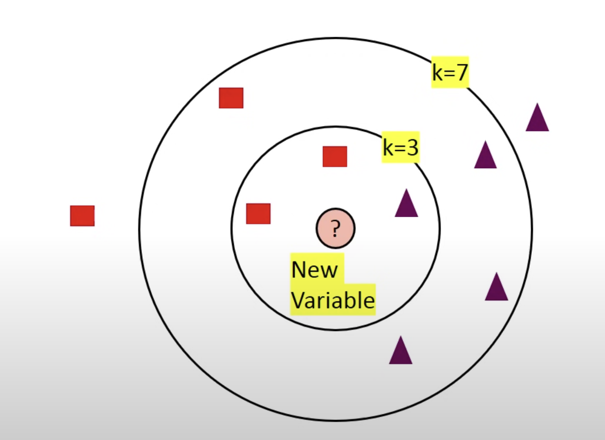

# KNN
[introduction to data mining](https://drive.google.com/file/d/1sxvjxZlDD5N1tftg_BMwq-2gbJTrN21_/view?usp=sharing)
- Capitolo 4 fino a 4.3
- Sezione 5.2

[python data science handbook](https://drive.google.com/file/d/1aB105lLMH3necZWv3ynPx3qqhI2tv32N/view?usp=sharing)

[yt video](https://www.youtube.com/watch?v=4HKqjENq9OU)

#### perchè usiamo knn?
è basato sulla **somiglianza** delle features, possiamo fare una *classificazione* usando lil **KNN classifier**

#### in cosa consiste l'algoritmo knn?
KNN è l'acronimo di **K Nearest Neighbors**, è uno dei più semplici modelli *supervised* di machine learning.
Quello che fa è **classificare** un punto in base a come i suoi vicini sono classificati.

il **K** nell'algorimo knn è un parametro che indica il numero di vicini da includere per classificare.

#### come scegliamo il valore di k?
l'algorimo knn è bassato sulla **somiglianza** delle features. La scelta del giusto valore di *k* è detta **parameter tuning**, ed è fondamentale per aumentare l'accuratezza.

La scelta del corretto valore di k è fondamentale. Se k è troppo piccolo, il modello sarà troppo sensibile al rumore, se k è troppo grande, L'algoritmo risulterà molto costoso in termini di tempo e risorse.

**best practices** 
- scegliere un valore di k pari a $\sqrt{n}$ dove $n$ rappresenta il numero di osservazioni all'interno del dataset.
- scegliere un valore di k **dispari** in modo da evitare confusioni tra due classi.

#### quando usare knn
è possibile utilizzarlo quando le features hanno delle **labels**, qundo i dati sono privi di **rumore** e quando il dataset è **piccolo** (knn è considerato un *lazy learner*)